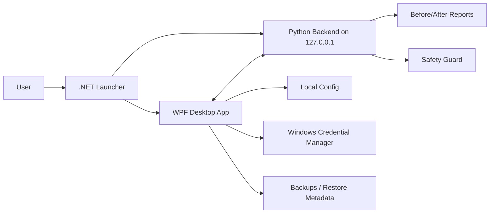

<div align="center">


<br />

[](https://github.com/jxxzy/HyperBoostX/releases/tag/v1.3.0)
[](#)
[](#)
[](#)
[](#-safety-guard)

<br />

[](https://github.com/jxxzy/HyperBoostX/releases/download/v1.3.0/HyperBoostXInstaller.exe)
[](USER_GUIDE.md)
[](RELEASE_NOTES_v1.3.0.md)
[](https://github.com/jxxzy/HyperBoostX/issues)

<br />

<h3>Premium Universal Windows Gaming Optimizer</h3>

<p>
For <b>NVIDIA GeForce GTX/RTX</b>, <b>AMD Radeon/RX/Vega</b>, <b>Intel Arc/iGPU</b>, <b>Microsoft Basic Display Adapter</b>, and unknown GPU fallback systems.
</p>

```text
Scan PC -> Hardware Profile -> Safe Plan -> User Approval -> Guarded Boost -> Before/After Report -> Undo
```

</div>

---

# 🚀 HyperBoostX

**HyperBoostX** is a modern Windows performance and optimization app built around **safety, explainability, and reversible changes**.

It combines a native **WPF desktop client**, **Python Flask local backend**, **.NET launcher**, **NSIS installer**, hardware-aware recommendations, AI-assisted planning, GPU Center, restore/undo metadata, before/after reports, and release-gated validation.

> HyperBoostX is not an overclocking tool, does not claim guaranteed FPS gains, and does not claim official partnership with NVIDIA, AMD, Intel, Microsoft, or any hardware vendor.

---

## ✨ Why HyperBoostX?

Most Windows optimizer tools are either too risky, too technical, or too aggressive.

HyperBoostX is different.

| Traditional Tweaker | HyperBoostX |
|---|---|
| Random one-click registry changes | Plan-first optimization |
| Hard to understand | Beginner-friendly explanations |
| Risky service disabling | Safety Guard blocks dangerous actions |
| No recovery path | Restore / undo metadata |
| FPS claims without proof | Before/after reports |
| NVIDIA-only mindset | NVIDIA, AMD, Intel, Microsoft Basic, and fallback GPU support |
| Advanced-user only | Built for beginners and power users |

---

## 🔗 Quick Links

| Need | Open This |
|---|---|
| Install the app | [Download `HyperBoostXInstaller.exe`](https://github.com/jxxzy/HyperBoostX/releases/download/v1.3.0/HyperBoostXInstaller.exe) |
| Learn how to use it | [Beginner User Guide](USER_GUIDE.md) |
| See what changed | [Release Notes v1.3.0](RELEASE_NOTES_v1.3.0.md) |
| Fix common issues | [Troubleshooting](TROUBLESHOOTING.md) |
| Read safety policy | [Security](SECURITY.md) |
| Report a bug | [Bug Report Template](BUG_REPORT_TEMPLATE.md) |
| Check release validation | [QA Results](QA_RESULTS.md) |

---

## 🧭 Table of Contents

- [Recommended Download](#-recommended-download)
- [Beginner Quick Start](#-beginner-quick-start)
- [For People Who Do Not Know Tweaks](#-for-people-who-do-not-know-tweaks)
- [Core Features](#-core-features)
- [v1.3.0 Highlights](#-v130-highlights)
- [GPU Support](#-gpu-support)
- [Safety Guard](#-safety-guard)
- [Feature Map](#-feature-map)
- [Common Workflows](#-common-workflows)
- [Architecture](#-architecture)
- [Backend API](#-backend-api)
- [Build And Test](#-build-and-test)
- [Documentation](#-documentation)
- [Known Limitations](#-known-limitations)
- [Credits](#-credits)

---

## 📥 Recommended Download

For normal users, download only the installer from the GitHub Release page.

| File | Recommended For |
|---|---|
| [`HyperBoostXInstaller.exe`](https://github.com/jxxzy/HyperBoostX/releases/download/v1.3.0/HyperBoostXInstaller.exe) | Normal users |
| [`SHA256SUMS.txt`](https://github.com/jxxzy/HyperBoostX/releases/download/v1.3.0/SHA256SUMS.txt) | Optional checksum verification |
| Source code zip | Developers only |

✅ Recommended:

```text
HyperBoostXInstaller.exe
```

❌ Do not download or run raw backend executables, debug folders, cache files, logs, or internal release artifacts unless you are developing or testing the project.

> If Windows shows `Unknown Publisher` or SmartScreen, it means the installer may be unsigned. Only continue if the file came from the official HyperBoostX GitHub Release.

Optional checksum verification:

```powershell
Get-FileHash .\HyperBoostXInstaller.exe -Algorithm SHA256
```

Expected SHA256 for v1.3.0:

```text
16024ADF082ACEBA47387A6A32B9C574BBF2FBB722EC3610286494AC95D764A8  HyperBoostXInstaller.exe
```

---

## ⚡ Beginner Quick Start

This is the safest path for users who do not understand Windows tweaking or optimization.

```text
Install -> Open HyperBoostX -> Dashboard -> Restore & Backup -> GPU Center -> Smart Recommendation -> One Click Boost -> Review Plan -> Approve -> Read Report -> Undo if needed
```

### Step-by-step

1. Download `HyperBoostXInstaller.exe`.
2. Install HyperBoostX.
3. Open HyperBoostX from Desktop or Start Menu.
4. Wait until backend/system status is connected.
5. Open `Dashboard`.
6. Open `Restore & Backup` so you know where recovery lives.
7. Open `GPU Center` and refresh GPU/vendor/overlay detection.
8. Open `Smart Recommendation`.
9. Choose `Safe Boost` or `One Click Boost`.
10. Review the plan before approving anything.
11. Click `Apply` only when the plan looks safe.
12. Read the before/after report.
13. If something feels wrong, open `Restore & Backup` and undo the last session.

Full beginner manual: [USER_GUIDE.md](USER_GUIDE.md)

Normal users do not need to start the backend manually. Launch HyperBoostX from the installed shortcut so the launcher can start the local backend, generate the local session token, open the WPF app, and clean up the runtime when the app closes.

---

## 🧑‍💻 For People Who Do Not Know Tweaks

HyperBoostX is designed for people who do not understand terms like registry, services, DNS cache, standby memory, startup impact, or power plan.

The beginner flow is simple:

```text
Scan PC
-> Read simple recommendation
-> Choose Safe Boost
-> Approve
-> Done
```

### Beginner meaning of each button

| Button / Menu | Simple Meaning |
|---|---|
| `Dashboard` | See your PC condition |
| `Scan PC` | Let HyperBoostX check what is slowing your PC |
| `Smart Recommendation` | Get safe suggestions in simple language |
| `Safe Boost` | Apply only safer optimizations |
| `One Click Boost` | Scan, plan, boost, and report in one guided flow |
| `Gaming Mode` | Prepare your PC before playing games |
| `Cleanup` | Remove safe temporary files |
| `Startup Manager` | Reduce apps that start with Windows |
| `Restore & Backup` | Undo changes if something feels wrong |
| `Advanced Tweaks` | Power-user area, not recommended for beginners |

### Beginner rules

- Start with `Safe Boost`.
- Do not enable every tweak manually.
- Do not disable Windows Security.
- Do not disable Windows Update permanently.
- Do not disable GPU, audio, network, or antivirus services.
- Always read the plan before clicking approve.
- Use `Restore & Backup` if anything feels different after optimization.

---

## 🧩 Core Features

HyperBoostX is built for guided use: scan first, explain the plan, ask for approval, apply safe actions, show what happened, and keep recovery visible.

| Area | What It Helps With |
|---|---|
| `Dashboard` | CPU, RAM, disk, network, health score, readiness score, activity, recommendation preview |
| `One Click Boost` | Safe plan-first optimization, user approval, report, and undo path |
| `GPU Center` | NVIDIA/AMD/Intel/Microsoft Basic/unknown GPU detection, vendor badge, overlays, VRAM, driver, profile |
| `Smart Recommendation` | Context-aware suggestions for cleanup, startup, overlays, network, and gaming readiness |
| `Gaming Mode` | Safer pre-game preparation without driver hacks or forced service disablement |
| `Streaming Mode` | OBS/Discord/network-aware preparation without breaking live tools |
| `Creator Mode` | Editing/rendering-focused recommendations for creator workflows |
| `Cleanup` | Safe temp/cache cleanup and cleanup report support |
| `Startup Manager` | Startup cleanliness review and safer startup decisions |
| `Network Tools` | DNS test, DNS refresh, latency diagnostics, and network recommendations |
| `Restore & Backup` | Restore metadata, undo path, restore point guidance, and recovery workflow |
| `AI Doctor / Copilot` | Plan-first AI analysis with Safety Guard and required approval |
| `Reports` | Before/after performance report and local crash report export with redaction |

---

## 🆕 v1.3.0 Highlights

- Universal GPU detection for NVIDIA, AMD Radeon, Intel Arc/iGPU, Microsoft Basic Display Adapter, and unknown fallback.
- GPU Center backend contract with vendor badge, model/family, VRAM, usage, temperature when available, driver version, overlays, vendor software, safe actions, skipped actions, and blocked risky actions.
- Hardware profile engine with PC Health, Gaming Readiness, Streaming Readiness, and Startup Cleanliness scoring.
- Safe boost flow that creates a plan first, explains risk, requires approval, blocks risky actions, and generates a before/after report.
- Local job queue for longer tasks with progress, stage, log tail, cancel, completion, and error states.
- Local API security with launcher-generated `X-HyperBoostX-Session` token when the packaged launcher starts the backend and WPF client.
- Local crash report export with redaction for API keys, AI keys, tokens, GitHub tokens, usernames, sensitive paths, and future license keys.
- Support docs, FAQ, troubleshooting, roadmap, bug report template, feature request template, and beginner guide.

---

## 🎮 GPU Support

HyperBoostX v1.3.0 includes safe detection paths for:

- NVIDIA GeForce GTX
- NVIDIA GeForce RTX
- AMD Radeon RX
- AMD Radeon Vega
- AMD Radeon integrated graphics
- Intel Arc
- Intel Iris Xe
- Intel UHD / iGPU
- Microsoft Basic Display Adapter
- Unknown GPU fallback

> GPU telemetry depends on Windows, drivers, WMI, and hardware counters. If temperature, VRAM usage, driver details, or active display data are unavailable, HyperBoostX should fall back safely instead of crashing.

---

## 🛡️ Safety Guard

HyperBoostX blocks or refuses unsafe behavior including:

- Forced Defender disable
- Permanent Windows Update disable
- GPU driver service disablement without a clear safe approval path
- BIOS/UEFI edits
- Overclock, undervolt, or voltage changes
- System-file deletion
- User-data deletion
- Irreversible registry edits without restore metadata
- AI-generated system actions without user approval

AI and automation must generate a plan first, explain risk, require user approval, respect Safety Guard, and preserve undo/restore metadata where applicable.

---

## ✅ Safe Beginner Rules

For regular users:

- Start with `Dashboard`, `GPU Center`, `Smart Recommendation`, and `One Click Boost`.
- Use safe or balanced mode before advanced modes.
- Read the action plan before clicking approve.
- Keep Safety Guard and Require Approval enabled.
- Use `Restore & Backup` before applying bigger changes.
- Do not use `Advanced Tweaks` or `Windows Services` unless you understand the risk.
- Do not disable Defender, Windows Update, GPU drivers, audio drivers, network services, or antivirus services.
- Do not expect guaranteed FPS gains; results depend on hardware, Windows state, drivers, background apps, games, and network conditions.

Recommended first-week flow for beginners:

```text
Day 1: Dashboard -> GPU Center -> Smart Recommendation -> One Click Boost safe -> Read report
Day 2+: Dashboard -> Startup Manager if boot is slow -> Cleanup safe if disk is full -> Gaming Mode before playing -> Restore & Backup if needed
```

---

## 🗺️ Feature Map

| Menu | Beginner Use | Risk Note |
|---|---|---|
| `Dashboard` | First screen to inspect PC condition | Safe read-only overview |
| `GPU Center` | Refresh GPU/vendor/overlay status | Do not disable GPU driver services |
| `Smart Recommendation` | Let HyperBoostX suggest safe next steps | Review before applying |
| `One Click Boost` | Run safe/balanced boost with approval | Read plan and report |
| `Cleanup` | Remove safe temp/cache files | Avoid deleting personal files |
| `Startup Manager` | Reduce startup clutter | Do not disable driver/security tools |
| `Background Apps` | Find heavy apps | Avoid force-killing system apps |
| `Gaming Mode` | Prepare before gaming | Do not pause tools you need while playing |
| `Streaming Mode` | Prepare OBS/Discord/live workflows | Do not pause streaming tools mid-live |
| `Creator Mode` | Prepare editing/rendering workflows | Save projects before cleanup |
| `Network Booster` | DNS and latency diagnostics | Does not guarantee lower ping |
| `Repair Tools` | SFC/DISM/network repair | Can take time and may need admin |
| `Restore & Backup` | Undo/recovery path | Use this first if anything feels wrong |
| `Settings` | Theme, safety, AI, app config | Keep Safety Guard enabled |
| `Advanced Tweaks` | Power-user controls | Not recommended for beginners |
| `Windows Services` | Service review | Do not disable services blindly |

---

## 🧪 Common Workflows

### Before Gaming

```text
Dashboard -> Scan PC -> GPU Center -> Smart Recommendation -> One Click Boost safe/balanced -> Gaming Mode -> Launch game
```

### After Gaming

```text
Dashboard -> Read report -> Keep changes if normal -> Restore & Backup if something feels wrong
```

### Streaming

```text
Open OBS/Discord -> Streaming Mode -> Network diagnostics -> Keep streaming tools active -> Start stream
```

### Slow Startup

```text
Dashboard -> Startup Manager -> Disable clearly unnecessary startup apps -> Cleanup safe -> Restart -> Dashboard
```

### High Ping Or Network Issues

```text
Dashboard -> Network Booster -> DNS & Latency Tools -> Flush DNS if recommended -> Retest
```

### Disk Almost Full

```text
Storage -> Cleanup safe -> Review Recycle Bin -> Delete only personal files you recognize
```

### Windows Feels Broken

```text
Repair Tools -> SFC Scan -> DISM Repair if needed -> Restart -> Dashboard -> Report
```

---

## 📊 Current Stable Target

| Item | Value |
|---|---|
| Version | `1.3.0` |
| Tag | `v1.3.0` |
| Release name | `HyperBoostX v1.3.0 Stable` |
| Public asset | `HyperBoostXInstaller.exe` |
| Optional asset | `SHA256SUMS.txt` |
| Branch | `main` |

Full multi-machine Windows lab compatibility is not claimed unless recorded in `QA_RESULTS.md`.

---

## ✅ Validation Snapshot

The v1.3.0 stable release was validated with:

- `scripts\verify_repo.ps1`: PASS
- Python tests: PASS, 43 tests
- .NET tests: PASS, 28 tests
- WPF Debug/Release builds: PASS
- Launcher Release build: PASS
- Backend PyInstaller package: PASS
- NSIS installer build: PASS
- Packaged backend health: PASS, version `1.3.0`
- Portable launch smoke: PASS
- Installer install/uninstall/reinstall smoke: PASS
- Secret scan: PASS
- SHA256 verification: PASS

See [QA_RESULTS.md](QA_RESULTS.md) for details and limitations.

---

## 🏗️ Architecture



| Component | Path | Purpose |
|---|---|---|
| Desktop UI | `wpf` | Native WPF interface, settings, update checks, audit flows, and feature pages |
| Backend | `app` | Flask API, monitoring, GPU detection, reports, optimization services |
| Launcher | `launcher` | Starts backend, injects local session token, launches WPF, and cleans up lifecycle |
| Tests | `tests`, `dotnet-tests` | Python and .NET validation suites |
| Installer | `HyperBoostXInstaller.nsi` | NSIS installer and uninstall metadata |

Legacy user data is preserved under `%LocalAppData%\HyperBoost X` for compatibility with previous stable installs.

---

## 🔌 Backend API

Base URL:

```text
http://127.0.0.1:5000
```

The backend is local-only for the desktop app. It is not a public cloud API and should not be exposed to the network.

Important v1.3.0 endpoints:

| Method | Endpoint | Purpose |
|---|---|---|
| `GET` | `/api/health` | Backend health check |
| `GET` | `/api/version` | App/backend version |
| `GET` | `/api/system/stats` | Live system stats |
| `GET` | `/api/system/info` | Windows and device info |
| `GET` | `/api/system/startup` | Startup app data |
| `GET` | `/api/system/processes` | Running process data |
| `GET` | `/api/hardware/profile` | Hardware profile and scores |
| `GET` | `/api/hardware/gpu` | GPU detection and telemetry |
| `GET` | `/api/hardware/vendors` | Hardware vendor info |
| `GET` | `/api/hardware/overlays` | Overlay/vendor app detection |
| `POST` | `/api/boost/plan` | Generate safe boost plan |
| `POST` | `/api/boost/apply` | Apply approved boost plan |
| `POST` | `/api/boost/undo` | Undo supported actions |
| `GET` | `/api/reports/latest` | Latest before/after report |
| `POST` | `/api/reports/export` | Export report |
| `POST` | `/api/reports/crash-export` | Export redacted crash report |
| `POST` | `/api/jobs/start` | Start long-running job |
| `GET` | `/api/jobs/{id}` | Read job progress |
| `POST` | `/api/jobs/{id}/cancel` | Cancel running job |

Mutating endpoints require `X-HyperBoostX-Session` when the packaged launcher supplies a session token.

---

## 🧰 Build And Test

For developers:

```powershell
powershell -ExecutionPolicy Bypass -File .\scripts\verify_repo.ps1
app\venv\Scripts\python.exe -m pytest -q tests
dotnet test dotnet-tests\HyperBoostX.Tests\HyperBoostX.Tests.csproj -c Debug
dotnet build wpf\HyperBoostX.csproj -c Release
dotnet build launcher\HyperBoostLauncher.csproj -c Release
```

Release scripts:

| Script | Purpose |
|---|---|
| `build_backend.bat` | Build/package backend |
| `build_release.bat` | Build release artifacts |
| `build_launcher.bat` | Build launcher |
| `package_release.bat` | Package release files |
| `build_installer.bat` | Build NSIS installer |

Normal users should not run these commands. They are for maintainers, contributors, and release validation.

---

## 📚 Documentation

For users:

- [USER_GUIDE.md](USER_GUIDE.md) - beginner-friendly complete user guide
- [FAQ.md](FAQ.md) - common user questions
- [TROUBLESHOOTING.md](TROUBLESHOOTING.md) - backend, install, GPU, restore, crash report help
- [SUPPORT.md](SUPPORT.md) - support workflow and bug report format

Release and engineering docs:

- [RELEASE.md](RELEASE.md)
- [RELEASE_NOTES_v1.3.0.md](RELEASE_NOTES_v1.3.0.md)
- [QA_RESULTS.md](QA_RESULTS.md)
- [AUDIT_REPORT.md](AUDIT_REPORT.md)
- [BUGS_FOUND.md](BUGS_FOUND.md)
- [BUGS_FIXED.md](BUGS_FIXED.md)
- [SECURITY.md](SECURITY.md)
- [ROADMAP.md](ROADMAP.md)
- [docs/API_REFERENCE.md](docs/API_REFERENCE.md)

---

## ⚠️ Known Limitations

- Automated validation in this workspace does not equal full multi-machine Windows lab certification.
- GPU temperature, VRAM usage, and driver metadata depend on Windows/WMI/driver support and may fall back to `Unknown`.
- AI cloud features require user-supplied credentials stored through Windows Credential Manager.
- If the installer is unsigned, Windows may show Unknown Publisher or SmartScreen until code signing is available.
- Auto updater, website, opt-in telemetry, and license activation are roadmap-only items.
- No v1.3.0 feature is locked behind a license.

---

## 🧾 Important Disclaimer

HyperBoostX is designed to help users understand, prepare, clean, and safely optimize their Windows system.

It does **not** guarantee:

- Fixed FPS increase
- Fixed ping decrease
- Hardware temperature decrease on every system
- Driver-level performance improvement on every GPU
- Compatibility with every Windows build, OEM laptop profile, or custom driver configuration

Results depend on hardware, Windows condition, background apps, installed drivers, power settings, game engine, network quality, and user configuration.

---

## 💚 Credits

Created by:

```text
MR.4NONY - HYPERINDO CYBER TEAM
```

<div align="center">


**HyperBoostX — Scan. Plan. Approve. Boost. Undo.**

</div>
