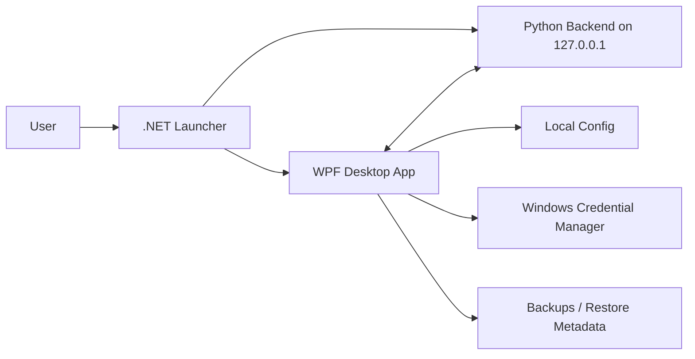

<div align="center">


[](https://github.com/jxxzy/HyperBoostX/releases/tag/v1.3.0)
[](#)
[](#)
[](#)

[](https://github.com/jxxzy/HyperBoostX/releases/download/v1.3.0/HyperBoostXInstaller.exe)
[](RELEASE_NOTES_v1.3.0.md)

**Premium Universal Windows Gaming Optimizer for NVIDIA GeForce GTX/RTX, AMD Radeon/RX, Intel Arc/iGPU, Microsoft Basic Display, and unknown GPU fallback systems.**

`Scan PC -> Hardware Profile -> Safe Plan -> User Approval -> Guarded Boost -> Before/After Report -> Undo`

</div>

---

# HyperBoostX

HyperBoostX is a Windows performance and optimization app built around safety, explainability, and reversible changes. It combines a WPF desktop client, Python local backend, .NET launcher, NSIS installer, hardware-aware recommendations, AI-assisted planning, restore/undo metadata, and release-gated validation.

HyperBoostX is not an overclocking tool and does not claim guaranteed FPS gains. It never claims official NVIDIA, AMD, Intel, Microsoft, or hardware-vendor partnership.

## Recommended Download

Download `HyperBoostXInstaller.exe`, run it, and follow the installer.

Optional: download `SHA256SUMS.txt` to verify the installer checksum.

Internal backend, launcher, raw WPF, portable, debug, temp, logs, and CI artifacts are not intended as public release assets.

## Current Stable Target

| Item | Value |
|---|---|
| Version | `1.3.0` |
| Tag | `v1.3.0` |
| Release name | `HyperBoostX v1.3.0 Stable` |
| Public asset | `HyperBoostXInstaller.exe` |
| Optional asset | `SHA256SUMS.txt` |
| Branch | `main` |

Full multi-machine Windows lab compatibility is not claimed unless recorded in `QA_RESULTS.md`.

## v1.3.0 Highlights

- Universal GPU detection for NVIDIA, AMD Radeon, Intel Arc/iGPU, Microsoft Basic Display, and unknown fallback.
- GPU Center backend contract with vendor badge, model/family, VRAM, usage, temperature when available, driver version, overlays, vendor software, safe actions, skipped actions, and blocked risky actions.
- Hardware profile engine with PC Health, Gaming Readiness, Streaming Readiness, and Startup Cleanliness scoring.
- Safe boost plan flow that creates a plan first, explains risk, requires approval, blocks risky actions, and generates a before/after report.
- Local job queue for long tasks with progress, stage, log tail, cancel, completion, and error states.
- Local API security with launcher-generated `X-HyperBoostX-Session` token when the packaged launcher starts the backend and WPF client.
- Release hygiene: recommended public download is the installer, with checksum as optional supporting asset.

## Safety Guard

HyperBoostX blocks or refuses unsafe behavior including:

- forced Defender disable
- permanent Windows Update disable
- GPU driver service disablement without explicit safe approval path
- BIOS/UEFI edits
- overclock, undervolt, or voltage changes
- system-file deletion
- user-data deletion
- irreversible registry edits without restore metadata
- AI-generated actions without user approval

AI and automation must generate a plan first, explain risk, require user approval, respect Safety Guard, and preserve undo/restore metadata where applicable.

## Architecture



| Component | Path | Purpose |
|---|---|---|
| Desktop UI | `wpf` | Native WPF interface, settings, updates, audit flows |
| Backend | `app` | Flask API, monitoring, GPU detection, reports, optimization services |
| Launcher | `launcher` | Starts backend, injects local session token, launches WPF, cleans up lifecycle |
| Tests | `tests`, `dotnet-tests` | Python and .NET validation suites |
| Installer | `HyperBoostXInstaller.nsi` | NSIS installer and uninstall metadata |

Legacy user data is preserved under `%LocalAppData%\HyperBoost X` for compatibility with previous stable installs.

## Backend API

Base URL: `http://127.0.0.1:5000`

Important v1.3.0 endpoints:

- `GET /api/health`
- `GET /api/version`
- `GET /api/system/stats`
- `GET /api/system/info`
- `GET /api/system/startup`
- `GET /api/system/processes`
- `GET /api/hardware/profile`
- `GET /api/hardware/gpu`
- `GET /api/hardware/vendors`
- `GET /api/hardware/overlays`
- `POST /api/boost/plan`
- `POST /api/boost/apply`
- `POST /api/boost/undo`
- `GET /api/reports/latest`
- `POST /api/reports/export`
- `POST /api/reports/crash-export`
- `POST /api/jobs/start`
- `GET /api/jobs/{id}`
- `POST /api/jobs/{id}/cancel`

Mutating endpoints require `X-HyperBoostX-Session` when the packaged launcher supplies a session token.

## Build And Test

```powershell
powershell -ExecutionPolicy Bypass -File .\scripts\verify_repo.ps1
app\venv\Scripts\python.exe -m pytest -q tests
dotnet test dotnet-tests\HyperBoostX.Tests\HyperBoostX.Tests.csproj -c Debug
dotnet build wpf\HyperBoostX.csproj -c Release
dotnet build launcher\HyperBoostLauncher.csproj -c Release
```

Release scripts:

- `build_backend.bat`
- `build_release.bat`
- `build_launcher.bat`
- `package_release.bat`
- `build_installer.bat`

## Documentation

- [RELEASE.md](RELEASE.md)
- [RELEASE_NOTES_v1.3.0.md](RELEASE_NOTES_v1.3.0.md)
- [QA_RESULTS.md](QA_RESULTS.md)
- [AUDIT_REPORT.md](AUDIT_REPORT.md)
- [BUGS_FOUND.md](BUGS_FOUND.md)
- [BUGS_FIXED.md](BUGS_FIXED.md)
- [SECURITY.md](SECURITY.md)
- [SUPPORT.md](SUPPORT.md)
- [FAQ.md](FAQ.md)
- [TROUBLESHOOTING.md](TROUBLESHOOTING.md)
- [ROADMAP.md](ROADMAP.md)
- [docs/API_REFERENCE.md](docs/API_REFERENCE.md)

## Known Limitations

- Automated validation in this workspace does not equal full multi-machine Windows lab certification.
- GPU temperature, VRAM usage, and driver metadata depend on Windows/WMI/driver support and may fall back to `Unknown`.
- AI cloud features require user-supplied credentials stored through Windows Credential Manager.
- If the installer is unsigned, Windows may show Unknown Publisher or SmartScreen until code signing is available.
- Auto updater, website, opt-in telemetry, and license activation are roadmap-only items; no v1.3.0 feature is license-locked.

## Credits

Created by `MR.4NONY - HYPERINDO CYBER TEAM`.
