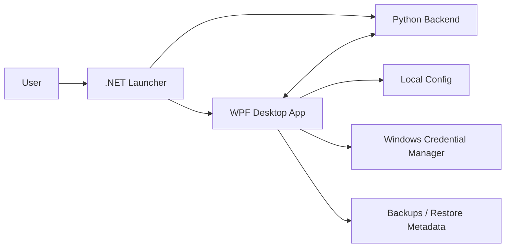

<div align="center">


[](https://github.com/jxxzy/HyperBoostX/releases/tag/v1.2.14)
[](#)
[](#)
[](#)
[](#)

[](https://github.com/jxxzy/HyperBoostX/releases/download/v1.2.14/HyperBoostXInstaller.exe)
[](https://github.com/jxxzy/HyperBoostX/releases/tag/v1.2.14)
[](RELEASE.md)

**Windows optimization suite for gaming PCs, creators, streamers, and power users.**

`Scan PC -> AI Analyzer -> AI Safety Guard -> User Approval -> Safe Tweak Engine -> Backup / Revert -> Performance Report`

</div>

---

# Welcome to HyperBoostX

**HyperBoostX** is a Windows performance and optimization application built around one idea: make PC tuning safer, clearer, and easier to reverse.

It combines a native WPF desktop app, a Python backend, a .NET launcher, real-time monitoring, release-gated installer packaging, and AI-assisted recommendations through a guarded NVIDIA-ready Copilot flow.

> **Goal:** help users understand what is happening on their PC, apply safe optimizations, and keep a path back through backup and restore.

---

# Quick Download

For normal users, the public release is intentionally simple:

```text
Download one file: HyperBoostXInstaller.exe
Run it.
Install HyperBoostX.
```

Public release page:

```text
https://github.com/jxxzy/HyperBoostX/releases/tag/v1.2.14
```

Direct installer:

```text
https://github.com/jxxzy/HyperBoostX/releases/download/v1.2.14/HyperBoostXInstaller.exe
```

Internal launcher, backend, and portable runtime executables are validation artifacts. They are not separate user downloads.

---

# Current Stable

| Item | Status |
|---|---|
| Version | `1.2.14` |
| Tag | `v1.2.14` |
| Channel | Stable |
| Public installer | `HyperBoostXInstaller.exe` |
| Branch | `main` |
| Author | `MR.4NONY - HYPERINDO CYBER TEAM` |

`v1.2.14` is the current validated stable release line after repository verification, backend validation, installer QA, secret handling checks, current-machine matrix checks, and real NVIDIA API gate validation.

Full multi-machine Windows lab matrix is **not claimed**.

---

# Feature Universe

| Area | What It Does |
|---|---|
| Dashboard | Real-time monitoring, quick actions, status cards, health overview |
| One Click Boost | Safe default optimization flow for common performance cleanup |
| Gaming Booster | Gaming-focused tuning, session preparation, and performance workflow |
| Streaming Mode | Stream-friendly optimization and background load awareness |
| Creator Mode | Creator/workstation-oriented performance workflow |
| Startup Manager | Startup process review and safe startup optimization |
| Cleanup & Storage | Cleanup tools, storage review, and safe scoped cleanup paths |
| Network Optimization | Network review, diagnostics, and guarded tuning paths |
| Power Optimization | Power profile handling with backup/restore metadata |
| Tweaks Center | Windows tweaks with safety checks and restore requirements |
| Repair Tools | Repair workflows for Windows, services, drivers, and health checks |
| Privacy & Security | Privacy Center, Security & Health, and guarded system actions |
| Automation | Scheduled Automation, persistent rules, and safe action routing |
| AI Copilot | NVIDIA-ready Copilot, model fallback, and approval-based suggestions |
| Webhooks | Discord error/update reporting with secret redaction |

---

# Triple AI Engine

HyperBoostX is designed as an **AI PC Performance Doctor**, not an unsafe extreme tweak tool.

| Role | Responsibility |
|---|---|
| AI Assistant | Explains bottlenecks, FPS-drop causes, NVIDIA/game settings, and safe actions |
| AI Analyzer | Ranks findings from scan data, Windows state, performance rules, and tweak policy |
| AI Safety Guard | Blocks unsafe or irreversible changes and requires approval/restore paths |

The AI flow is intentionally guarded:

```text
Scan PC
  -> AI Analyzer
  -> AI Safety Guard
  -> AI Assistant
  -> User Approval
  -> Safe Tweak Engine
  -> Backup / Revert
  -> Performance Report
```

Cloud AI is optional. Basic scan, local rules, Safety Guard validation, reports, backup, and revert flows continue to work without an AI API key.

---

# Safety First

HyperBoostX must prefer safety over aggressive tweaking.

The app should always prioritize:

- Scan before action
- Explanation before execution
- User approval before system tweaks
- Backup before risky changes
- Restore/revert metadata where applicable
- Clear report after action
- Secret redaction in logs, state, reports, and crash paths

HyperBoostX must not claim or perform:

- Guaranteed FPS improvement
- Official NVIDIA partnership
- Forced overclocking
- Undervolting
- BIOS/UEFI modification
- Voltage tuning
- Forced Windows Security disable
- Irreversible registry edits without restore metadata

NVIDIA-aware language is allowed only for supported guidance such as RTX, DLSS, Reflex, Frame Generation, NVIDIA settings, and NVIDIA API model usage. This project is not an official NVIDIA product or partnership claim.

---

# Architecture



| Component | Path | Purpose |
|---|---|---|
| Desktop UI | `wpf` | Native WPF interface, orchestration, settings, update flow |
| Backend | `app` | Python Flask API, optimization services, monitoring, repair logic |
| Launcher | `launcher` | Starts backend, waits for health readiness, opens UI, cleans up process lifecycle |
| Tests | `tests`, `dotnet-tests` | Python and .NET validation suites |
| Scripts | `scripts` | CI/local build, validation, installer/e2e helpers |
| Docs | `docs` | API docs, release notes, release gates, historical docs |

---

# Runtime Layout

Installed app entrypoint:

```text
HyperBoostX.exe
```

Internal runtime layout:

```text
runtime\wpf\HyperBoostX.exe
runtime\backend\hyperboost_backend.exe
```

User data locations:

```text
%LocalAppData%\HyperBoost X\logs
%LocalAppData%\HyperBoost X\config
%LocalAppData%\HyperBoost X\backups
```

Secrets such as NVIDIA API keys and Discord webhook URLs are stored through Windows Credential Manager, not plaintext app-state.

---

# Tech Stack

<div align="center">


</div>

---

# Build & Run

Run backend only:

```bat
start_backend.bat
```

Run WPF client against a running backend:

```bat
start_wpf_client.bat
```

Build main artifacts:

| Script | Output |
|---|---|
| `build_backend.bat` | `release\backend\hyperboost_backend.exe` |
| `build_release.bat` | `release\wpf` |
| `build_launcher.bat` | `release\launcher` |
| `package_release.bat` | `release\package`, `release\app` |
| `build_installer.bat` | `HyperBoostXInstaller.exe` |

Run unified repository verification:

```powershell
powershell -ExecutionPolicy Bypass -File .\scripts\verify_repo.ps1
```

Useful flags:

```powershell
-Configuration Release
-SkipPython
-SkipDotnet
-NoRestore
```

---

# Release Gate

Latest stable gate: `v1.2.14`

Passed in the final validation line:

- Repository verification
- Python tests
- .NET tests
- Debug and Release build checks
- Backend package
- WPF package
- Launcher package
- NSIS installer build
- Packaged backend health
- Portable launch smoke
- Installed app launch
- Silent installer install
- Silent uninstall
- Silent reinstall
- Restore/undo metadata validation
- Secret handling validation
- NVIDIA API real connection gate from secure storage
- AI approval flow
- Safety Guard
- SHA256 verification

Not claimed:

- Full multi-machine Windows lab matrix
- Official NVIDIA partnership
- Guaranteed FPS improvement

---

# Testing Matrix

HyperBoostX includes an in-app **Feature Audit / Testing** area:

| Mode | Purpose |
|---|---|
| Mock Mode | Safe simulated checks |
| Safe Read-Only | Non-mutating machine inspection |
| Live Read-Only | Real local status collection without risky writes |
| Unit / Integration | Code and service contract validation |
| UI Flow | User workflow coverage |
| End-to-End | Runtime path validation |
| Regression | Prevents known issues from returning |
| Security | Secret, updater, and safety checks |
| Compatibility | Windows/runtime readiness checks |

GitHub Actions workflows:

```text
.github/workflows/windows-ci.yml
.github/workflows/release-gate.yml
.github/workflows/windows-e2e-lab.yml
```

The self-hosted Windows e2e lab workflow is intended for a controlled lab runner, not a normal user machine.

---

# Documentation Map

| Document | Description |
|---|---|
| [BUILD.md](BUILD.md) | Build commands and expected outputs |
| [INSTALL.md](INSTALL.md) | Installer, uninstall, portable QA, and data preservation notes |
| [SECURITY.md](SECURITY.md) | Local API, credential, redaction, AI safety, and restore policy |
| [USER_GUIDE.md](USER_GUIDE.md) | Dashboard, boost, restore, and NVIDIA Copilot usage |
| [RELEASE.md](RELEASE.md) | Release gates, installer-only public asset policy, and validation notes |
| [QA_RESULTS.md](QA_RESULTS.md) | Latest QA validation results |
| [AUDIT_REPORT.md](AUDIT_REPORT.md) | Current audit summary |
| [BUGS_FOUND.md](BUGS_FOUND.md) | Findings and known issues |
| [BUGS_FIXED.md](BUGS_FIXED.md) | Fixed bugs and completed repairs |
| [DIRECTORY_MAP.md](DIRECTORY_MAP.md) | Repository structure map |
| [docs/API_REFERENCE.md](docs/API_REFERENCE.md) | Backend API overview |
| [docs/release-notes/](docs/release-notes/) | Historical release notes |
| [docs/release-gates/](docs/release-gates/) | Historical release gate docs |

---

# Project Principles

```text
Build for speed.
Guard for safety.
Explain before action.
Backup before mutation.
Revert when needed.
Ship with evidence.
```

---

# Credits

Created by:

```text
MR.4NONY - HYPERINDO CYBER TEAM
```

Maintained as part of the MR.4NONY Windows optimization, automation, and AI tooling lab.

<div align="center">


</div>
